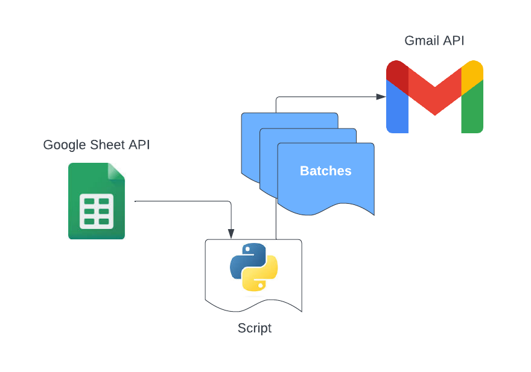
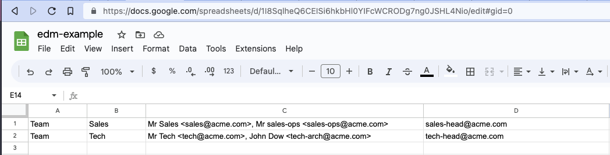
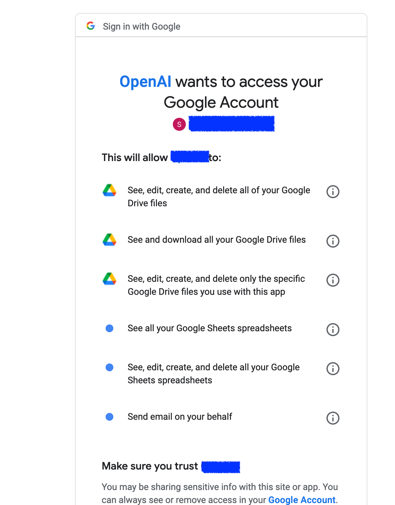

# Email Announcements Automation tool

This small project appeared because of frustration in EDM (Electronic Direct Mail) marketing tools. They are great, but sometimes people ignore emails as they see it as marketing rubbish. When EDM sent, all users receive an individual email without understanding whom else it was sent in their company and organisation. This tool allows you to send emails in batches to groups of people to make emails looking naturals and sent from your mailbox.

For instance you have 3 teams working who you would like to announce about new feature. Instead of emailing them individually the tool can send 3 email to the group of people visible in "TO" and "CC". This looks more people2people communication and induct them to reply as email sent from YOU. Of course it won't help you to get leads or good responses if you do not have certain level of trust with you customers/leads. This is just an automation tools what extends your smart mind.

## How it works

<p align="center">

</p>

The scrip uses following Google APIs:

- Gmail
- Google Drive
- Google Sheets

Therefore you need to download Google oAuth token from google console and save it in `google-creds` folder.

**First** thing you need to do is create Google Sheet with emails of people what you would like to interact. For instance it may looks like this:

<p align="center">

</p>

| Column | Description                                        |
| :----: | :------------------------------------------------- |
|   A    | Name of the team or name (used for Jinja template) |
|   B    | Last name (if needed)                              |
|   C    | comma separated list of To                         |
|   D    | comma separated list of CC                         |

**Second** Prepare Jinja template what for EDM. Default is HTML and save it announcements folder.

**Third** Update configuration file

```PYTHON
# Google Spreadseet ID with emails
SPREADSHEET_ID = "SoMeThIngLiKeThIs"
# Name of Spreadsheet tab
SPREADSHEET_TAB = "Tabname"
# Email Subject
SUBJ = "G'Day man, Rise and shine!"
# Path to JSON with google oAuth
CREDS_PATH = "google-creds/my-creds.json"
# Template to use
TEMPLATE = "announcements/example.html"
```

`SPREADSHEET_ID` - Google doc id, can be extracted from document url. For instance the Sheet URL is https://docs.google.com/spreadsheets/d/1I8SqlheQ6CEISi6hkbHl0YIFcWCRODg7ng0JSHL4Nio/edit#gid=0, and `1I8SqlheQ6CEISi6hkbHl0YIFcWCRODg7ng0JSHL4Nio` is document ID.

`SPREADSHEET_TAB` - Spreadsheet tab name

`SUBJ` - Subject of EDM (no Jinja)

`CREDS_PATH` - path with google oAuth credentials

`TEMPLATE` - path to email body (Jinja)

You may have many configuration files, as presumably you would like to keep announcement relevant for certain people. For instance I do not want to send announcements about developer feature to infrastructure guys or DevOps.

## Installation

`make install`

or

```<bash>
	python3 -m venv .venv
	source ./.venv/bin/activate
	python3 -m pip install --upgrade pip
	pip install -r requirements.txt
```

## Usage

Simply run the script with `-c` parameter point to the configuration file.

```
❯ python main.py -h
usage: main.py [-h] -c FILE

Config file

options:
  -h, --help            show this help message and exit
  -c FILE, --config FILE
                        path to config file
```

Run with config `test.py`

```
❯ python main.py -c configs/test.py
Please visit this URL to authorize this application: https://accounts.google.com/o/oauth2/auth?response_type=code&client_id=000000-<skip...skip...skip>
```

After run, you will be redirected to Google SignIn page to select account you would like to use

<p align="center">

</p>

After sucessfull authorisation script prints user groups

```
[{'cc': 'sales-head@acme.com',
  'email': 'Mr Sales <sales@acme.com>, Mr sales-ops <sales-ops@acme.com>',
  'last_name': 'Sales ',
  'name': 'Team'},
 {'cc': 'tech-head@acme.com',
  'email': 'Mr Tech <tech@acme.com>, John Dow <tech-arch@acme.com>',
  'last_name': 'Tech',
  'name': 'Team'}]
Do you want to send email to 2 groups?
```

If you type "Y" or "Yes" script will send emails
